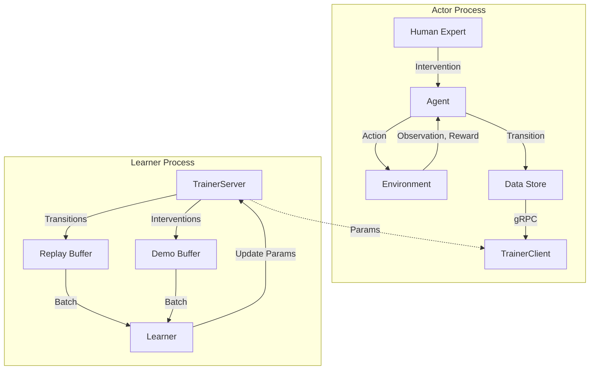

# RLPD (Reinforcement Learning with Prior Data) 算法详解

本文档基于 `train_rlpd.py` 代码实现及相关分析文档，详细解析 HIL-SERL 框架中使用的 RLPD 算法。

## 1. 算法概述

RLPD (Reinforcement Learning with Prior Data) 是一种结合了**离线演示数据（Offline Demo Data）**和**在线强化学习（Online RL）**的高效训练算法。它的核心思想是通过混合使用高质量的专家演示数据和智能体在线收集的经验数据，来加速策略学习并提高最终性能。

在 HIL-SERL 框架中，RLPD 被用于解决复杂的机器人操作任务（如精密装配），并集成了**人类介入（Human-in-the-loop）**机制，允许专家在训练过程中实时纠正智能体行为。

## 2. 系统架构 (Actor-Learner 分离)

为了满足实时性要求，系统采用了标准的 Actor-Learner 分布式架构：



### 2.1 关键组件
*   **Actor**: 负责与环境交互、收集数据。它运行在 CPU 或边缘设备上，通过 `TrainerClient` 与 Learner 通信。支持人类通过 SpaceMouse 进行实时干预。
*   **Learner**: 负责模型训练、参数更新。它运行在 GPU 服务器上，维护经验缓冲区，并通过 `TrainerServer` 接收数据和分发参数。

### 2.2 数据流向
1.  **在线数据流**：Actor 收集的正常交互数据 -> `data_store` -> Learner `replay_buffer`。
2.  **演示数据流**：
    *   **预收集演示**：启动时加载到 `demo_buffer`。
    *   **在线干预**：人类干预产生的数据 -> `intvn_data_store` -> Learner `demo_buffer`。
3.  **参数流**：Learner 更新网络 -> `publish_network` -> Actor `update_params`。

## 3. RL 训练细节 (核心机制)

RLPD 的高效性主要归功于其独特的采样和更新策略。

### 3.1 双缓冲区机制 (Dual Buffer)
代码中维护了两个独立的经验缓冲区：
1.  **`replay_buffer` (Online Buffer)**: 存储 Actor 在线收集的所有数据（包括随机探索和策略执行的数据）。这些数据通常包含大量的失败尝试，奖励稀疏。
2.  **`demo_buffer` (Demo Buffer)**: 存储专家演示数据。这些数据来源于预收集的专家轨迹和在线训练时的人类干预。这些数据通常是成功的轨迹，包含密集的正奖励。

### 3.2 50/50 混合采样策略
RLPD 的标志性特征是其采样比例。在每次训练迭代中，从两个缓冲区各采样 `batch_size / 2` 的数据：

```python
# train_rlpd.py 中的实现
replay_iterator = replay_buffer.get_iterator(batch_size=config.batch_size // 2)
demo_iterator = demo_buffer.get_iterator(batch_size=config.batch_size // 2)

# 合并批次
batch = concat_batches(next(replay_iterator), next(demo_iterator))
```

**为什么是 50/50？**
虽然两个缓冲区的数据量差异巨大（在线数据量 >> 演示数据量），但强制 50% 的样本来自演示数据，确保了智能体在每一此更新中都能“看到”成功的范例。这在奖励稀疏的任务中至关重要，防止了策略在漫长的探索中遗忘成功路径。

### 3.3 梯度更新流程 (Critic & Actor)
为了提高计算效率（减少 CPU 到 GPU 的传输开销）并稳定训练，代码实现了 **多步 Critic 更新**：

1.  **Critic 更新循环** (`cta_ratio - 1` 次)：
    *   采样混合批次 (50/50)。
    *   仅更新 Critic 网络（`Q` 函数）。
    *   **目的**：让 Critic 更准确地拟合当前策略和数据的价值分布，为 Actor 提供更准的梯度。

2.  **联合更新** (1 次)：
    *   采样混合批次 (50/50)。
    *   同时更新 Critic、Actor（策略网络）和 Temperature（熵系数）。

**Loss 函数细节**：
*   **Critic**: 标准的 TD-Error (Bellman Error)，最小化预测 Q 值与目标 Q 值 (`r + gamma * Q_target`) 的均方差。
*   **Actor**: 最大化期望 Q 值与熵的加权和 (`Q - alpha * log_prob`)。

### 3.4 为什么有效？(Critic 学习机制详解)
根据 `critic_learning_mechanism.md` 的深入分析，RLPD 有效的根本原因在于**演示数据主导了有效梯度的贡献**。

*   **稀疏奖励问题**：在精密装配等任务中，只有成功才有奖励 (`r=1`)，失败为 `r=0`。在线数据中绝大多数是失败的（无梯度或梯度极小）。
*   **梯度贡献**：演示数据几乎全是成功的 (`r=1`)。计算 Loss 时，演示数据产生的 TD-Error 远大于在线数据。
*   **结果**：虽然采样比例是 50/50，但**有效梯度可能有 90% 以上来自演示数据**。这使得 Critic 迅速学会识别“成功状态”的高价值，并通过价值传播（Bellman更新）将高价值回传到整个成功轨迹。Actor 进而通过最大化 Q 值，隐式地学会了模仿专家的动作。

## 4. 人类干预机制 (Human-in-the-loop)

代码通过 `SpacemouseIntervention` 实现人机协作。

### 4.1 干预触发与执行
*   **监测**：Actor 循环中实时监测 SpaceMouse 输入。
*   **接管**：一旦检测到输入，`intervene_action` 会覆盖智能体的策略动作 (`agent_action`)。
*   **执行**：环境执行专家的动作。

### 4.2 数据特殊处理
干预产生的数据具有双重属性，被特殊处理以最大化利用：
```python
# train_rlpd.py:199-203
data_store.insert(transition)          # 存入在线缓冲区 (作为普通经验)
if already_intervened:
    intvn_data_store.insert(transition) # 同时存入演示缓冲区 (作为专家经验)
```
这意味着人类纠正的数据会立即进入 `demo_buffer`，并在随后的训练中以 50% 的高概率被采样到。这实现了**“即时纠正，即时学习”**的闭环。

## 5. 代码结构映射

以下是关键逻辑在 `examples/train_rlpd.py` 中的位置映射：

| 功能模块 | 代码位置 | 说明 |
| :--- | :--- | :--- |
| **Actor 循环** | `actor()` 函数 (L68) | 处理环境交互、干预检测 |
| **Learner 循环** | `learner()` 函数 (L246) | 处理训练主循环 |
| **数据源定义** | `main()` L456, L462 | 初始化 `replay_buffer` 和 `demo_buffer` |
| **混合采样器** | `learner()` L290-303 | 创建两个 `get_iterator`，各取一半 batch |
| **Critic 更新** | `learner()` L320-330 | 循环执行 `cta_ratio-1` 次 Critic update |
| **Actor 更新** | `learner()` L332-339 | 执行 1 次联合 update |
| **干预数据存储** | `actor()` L201-203 | 干预数据双重存储逻辑 |
| **演示数据加载** | `learner()` L465-471 | 启动时加载离线 pkl 数据 |

## 总结

RLPD 算法通过**Actor-Learner 分离架构**解决了训练与采样的并发问题，通过**50/50 混合采样**解决了稀疏奖励下的探索难题，并通过**人类干预机制**实现了高效的策略纠正。其核心在于利用高质量的演示数据产生强烈的奖励信号，引导 Critic 快速建立正确的价值评估体系，从而指导 Actor 学习到正确的操纵策略。
